# Sistema de Parqueadero Automatizado

### Paola Alejandra Bello Buitrago- Jose Miguel Sanchez Vargas- Juan Daniel Nova Ruiz

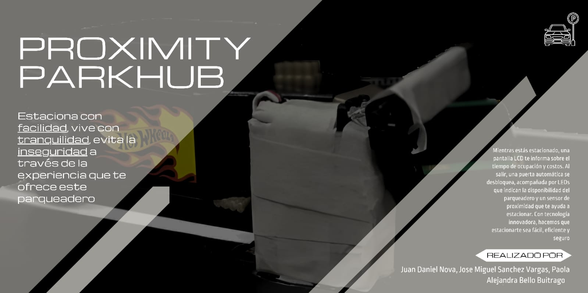

## Descripción y Contexto del Problema

En el mundo moderno, los parqueaderos se han convertido en una necesidad en casi todos los lugares, desde centros comerciales hasta residencias y oficinas. Sin embargo, el proceso de estacionamiento puede ser estresante y desafiante, especialmente en espacios reducidos o en horas de alto flujo.

De acuerdo con esto se pueden generar algunos inconvenientes, de los cuales remarcaremos estos problemas usuales:

•	Dificultad para encontrar un espacio vacío: En un parqueadero grande o lleno, los conductores pueden pasar mucho tiempo buscando un espacio disponible.

•	Riesgo de colisiones: Sin la ayuda de un sistema de guía, los conductores pueden llegar a chocar con la parte trasera o no acomodar bien el vehículo.

•	Inconveniencia en el pago: El proceso de pago puede ser lento y requerir interacción humana, lo que puede causar retrasos.

Por lo cual buscamos resolver estos problemas mediante la implementación de un sistema de parqueadero automatizado.

Con la ayuda de la electrónica digital, planteamos un sistema que utiliza sensores y actuadores para mejorar la experiencia de estacionamiento, aumentando la eficiencia y la seguridad. Algunas de las cosas que incluye el sistema son:

•	Un sensor de proximidad que abrirá la puerta del parqueadero automáticamente y alertará al conductor si está demasiado cerca de un obstáculo.

•	Una pantalla LCD que mostrará diferentes estados, como un mensaje de bienvenida cuando el parqueadero esté vacío, el tiempo de ocupación cuando un vehículo esté estacionado, y el costo total cuando el vehículo se vaya.

•	Una puerta automática movida por un servomotor que se basa en que tan cerca está el automóvil para ingresar y cuando sale, esta misma llevará unos leds para informar el estado del parqueadero, si está o no desocupado.

## Implementación 
Este fue el resultado de la implementación del proyecto.
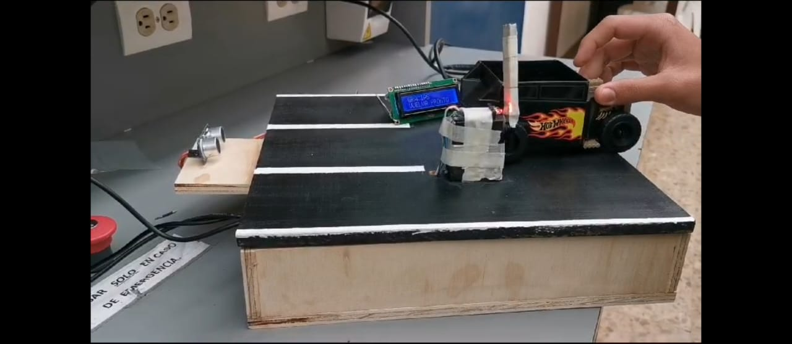
y este fue el diseño que se implementó:
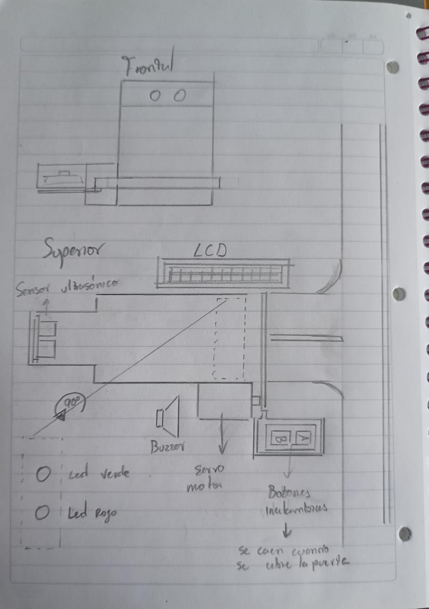
y la implementación de diseño:
https://youtu.be/jPZK3ZmsXpM

## Metodología

Para llevar a cabo este proyecto, utilizaremos Digital (una herramienta que modela sistemas digitales) para convertir nuestros diseños a Verilog (un lenguaje de descripción de hardware utilizado en la electrónica digital). A medida que avanzamos, adaptamos cada parte del proyecto de acuerdo con los conceptos y técnicas aprendidos en la materia de Electrónica Digital 1.

Revisemos las funciones que se usaron para llevar a cabo este proyecto:

•	Top

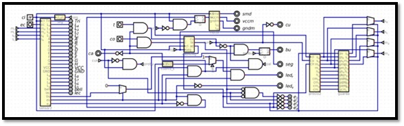

En el top se encuentra el proyecto condensado ya con todas las funciones, este es el que se sube a la FPGA que lo implementa.

•	sensor2

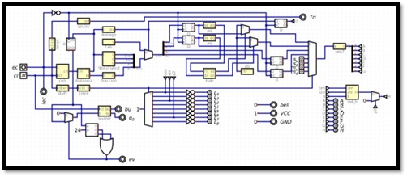

Este sistema es para usar el sensor de proximidad y trabajar con su funcionamiento para tomar el dato de la distancia en una base numérica. Aunque también tiene implementaciones en actuadores, como el buzzer y los leds.

•	relojC

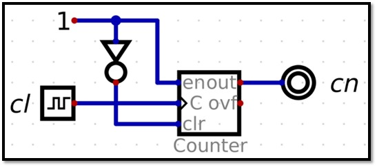

•	cntr

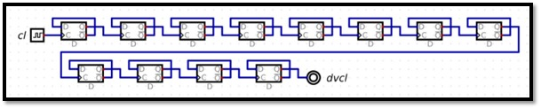

•	divFl

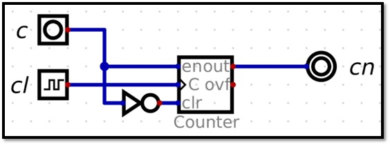

Divisor de frecuencia realizado con 12 FF tipo D.

•	tpulso

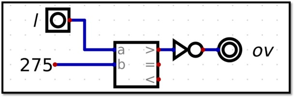

•	distancia

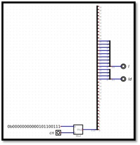

•	cntr4

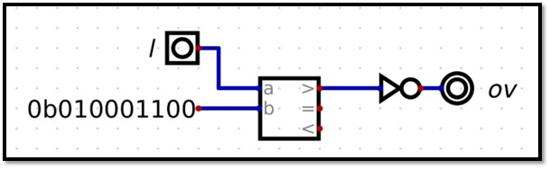

•	Nollego

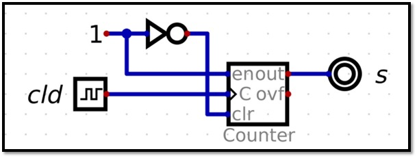

•	F.alc

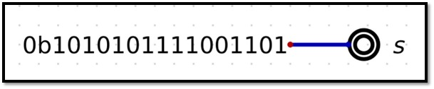

•	9bitsToBcd

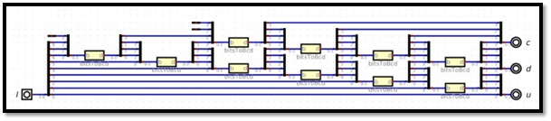

Para realizar el conversor a BCD se necesita de un sumador completo implementado en el subsistema bitToBcd.

•	bitsToBcd

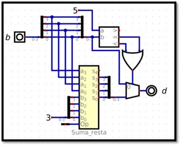

•	Suma_resta

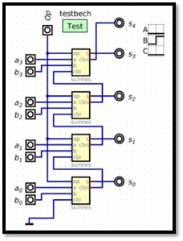

•	Sumres

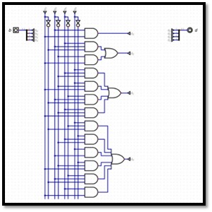

•	Fracción

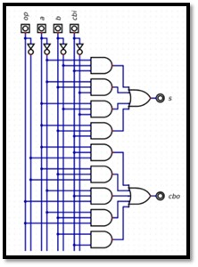

•	Buzzer

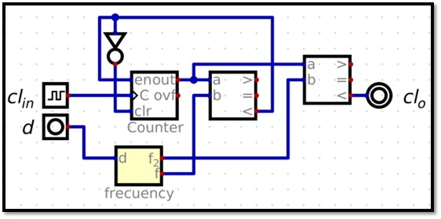

•	La

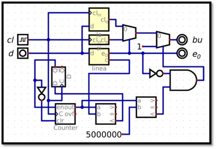

•	Frecuency

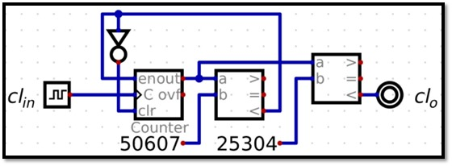

•	Si

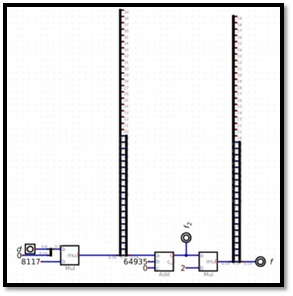

•	Línea

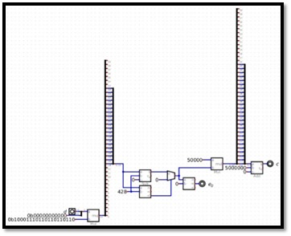

•	Eq

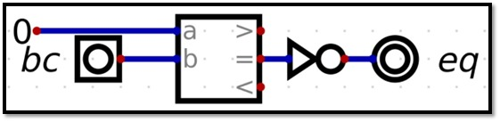

•	Hide

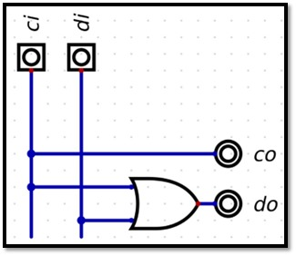

•	Ctr

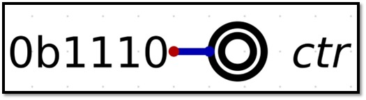

•	Seg7

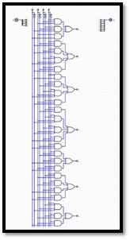

•	Led_h

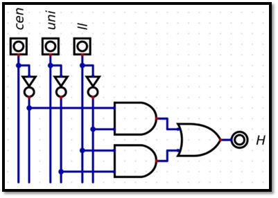

•	Seg

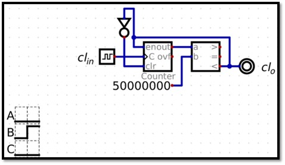

•	cuarto_s

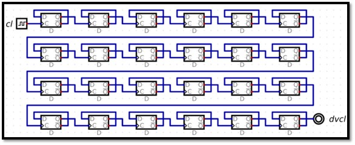

•	counting

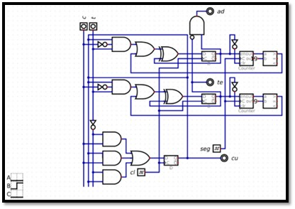

•	motor

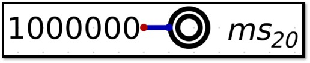

•	ms20

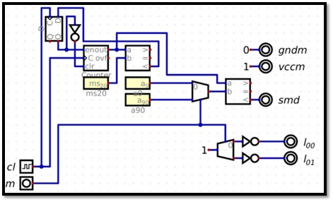

•	a0

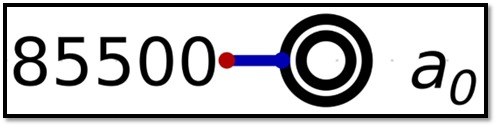

•	a90

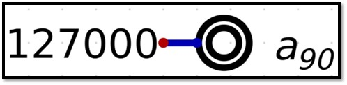

•	precio2

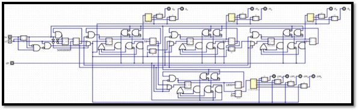

•	9bitsToBcd

•	bitsToBcd

•	Suma_resta

•	Sumres

•	11bitsToBcd

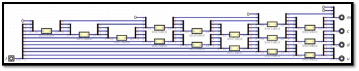

•	bitsToBcd

•	Suma_resta

•	Sumres

•	guarda

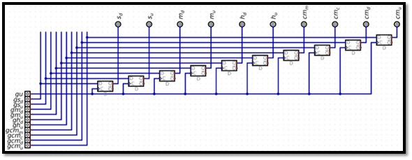

